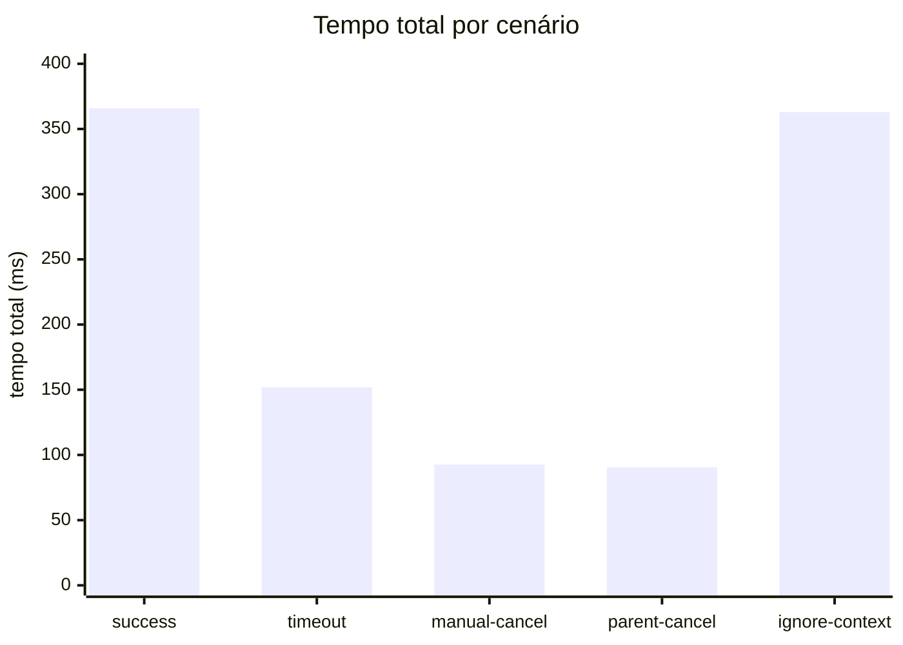
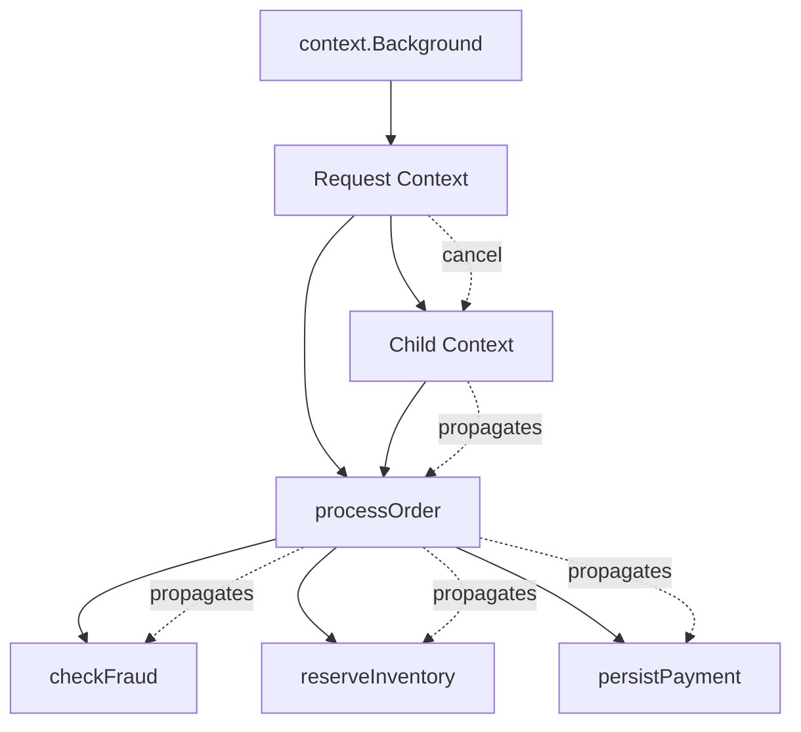

# Context: timeout, cancelamento e propagação

Este experimento simula um fluxo backend de processamento de pedido para
mostrar como `context.Context` interrompe trabalho que deixou de ser útil.

```text
HTTP request
   ↓
processOrder(ctx)
   ↓
checkFraud(ctx)
reserveInventory(ctx)
persistPayment(ctx)
```

## Hipótese

Com três etapas de `120 ms`, `180 ms` e `60 ms`:

- `success` deve concluir as três etapas em aproximadamente `360 ms`;
- `timeout` deve parar quando o prazo de `150 ms` expirar;
- `manual-cancel` deve parar quando `cancel()` for chamado após `90 ms`;
- `parent-cancel` deve mostrar que cancelar o contexto pai cancela o filho;
- `ignore-context` deve continuar por `360 ms`, mesmo após o cancelamento.

## Executar

Na raiz do repositório:

```bash
go run ./season-0/concurrency/02-context-timeout-cancel
```

Para executar apenas um cenário:

```bash
go run ./season-0/concurrency/02-context-timeout-cancel -scenario=timeout
go run ./season-0/concurrency/02-context-timeout-cancel -scenario=manual-cancel
go run ./season-0/concurrency/02-context-timeout-cancel -scenario=parent-cancel
go run ./season-0/concurrency/02-context-timeout-cancel -scenario=ignore-context
```

A saída é CSV:

```csv
scenario,total_ms,completed_steps,canceled_steps,error
success,360.000,3,0,nil
timeout,150.000,1,1,context deadline exceeded
manual-cancel,90.000,0,1,context canceled
parent-cancel,90.000,0,1,context canceled
ignore-context,360.000,3,0,nil
```

Os valores variam conforme máquina, sistema operacional, versão do Go e carga
do ambiente. A saída pode ser salva para análise:

```bash
go run ./season-0/concurrency/02-context-timeout-cancel \
  > season-0/concurrency/02-context-timeout-cancel/results/context-results.csv
```

## Resultado medido

Uma execução com Go 1.25.11 em Linux produziu:

```csv
scenario,total_ms,completed_steps,canceled_steps,error
success,365.912,3,0,nil
timeout,151.856,1,1,context deadline exceeded
manual-cancel,92.599,0,1,context canceled
parent-cancel,90.563,0,1,context canceled
ignore-context,362.930,3,0,nil
```

Os dados são uma única amostra do ambiente de desenvolvimento, não uma garantia
de tempo exato. O valor do experimento está na diferença de comportamento entre
os cenários.

## Gráfico



## O que é medido

`total_ms` é o tempo que a aplicação levou para retornar. `completed_steps`
conta etapas concluídas. `canceled_steps` conta etapas que observaram
`ctx.Done()` e retornaram antes de terminar o trabalho simulado. `error`
diferencia `context.Canceled` de `context.DeadlineExceeded`.

O cenário `ignore-context` cria um contexto cancelável, chama `cancel()` após
`90 ms` e ainda assim executa todas as etapas até o fim. Isso demonstra que
`context` não mata goroutines nem interrompe funções automaticamente: o código
precisa observar `ctx.Done()` e retornar.

## Propagação



## Interpretação

`context.Context` carrega sinais de cancelamento e deadline ao longo da cadeia
de chamadas. Em código de produção, isso aparece em handlers HTTP, consultas ao
banco de dados, chamadas externas, filas e workers.

O padrão idiomático é passar `ctx context.Context` explicitamente como primeiro
parâmetro das funções que participam da operação. Evite armazenar `Context` em
structs, porque isso mistura escopos de requisições diferentes e dificulta
entender qual deadline ou cancelamento vale para cada chamada.

## Cuidados em produção

Sempre chame a `CancelFunc` retornada por `context.WithCancel`,
`context.WithTimeout` ou `context.WithDeadline` quando o contexto derivado não
for mais necessário. Isso libera recursos associados ao contexto.

Timeouts devem ser definidos perto da fronteira da operação: entrada HTTP,
chamada externa, operação de banco ou consumo de mensagem. Funções internas
devem receber e propagar o contexto recebido, sem inventar deadlines globais
escondidos.
